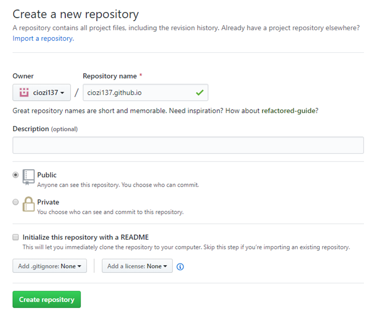
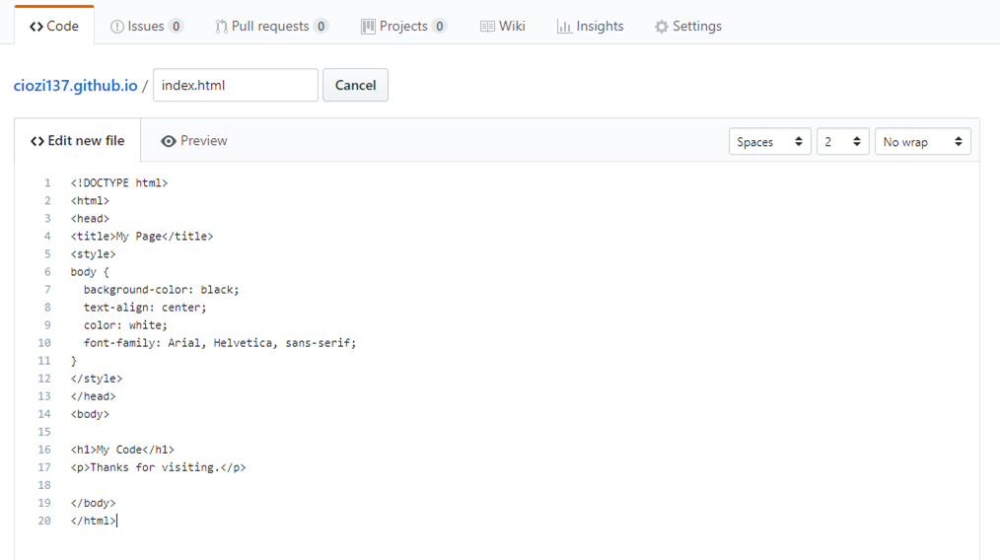
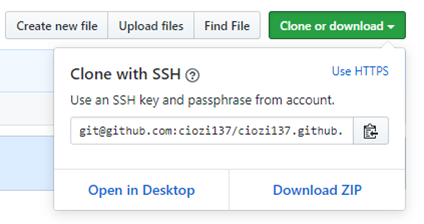
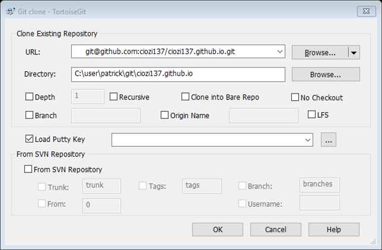
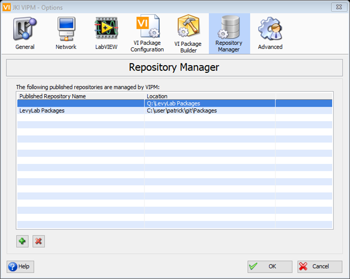
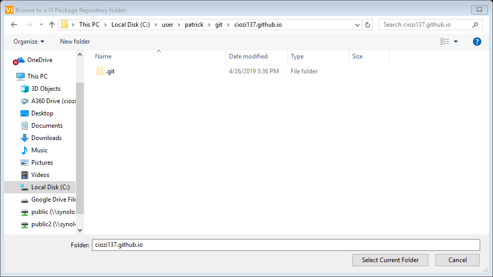
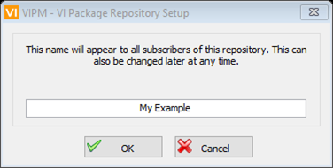
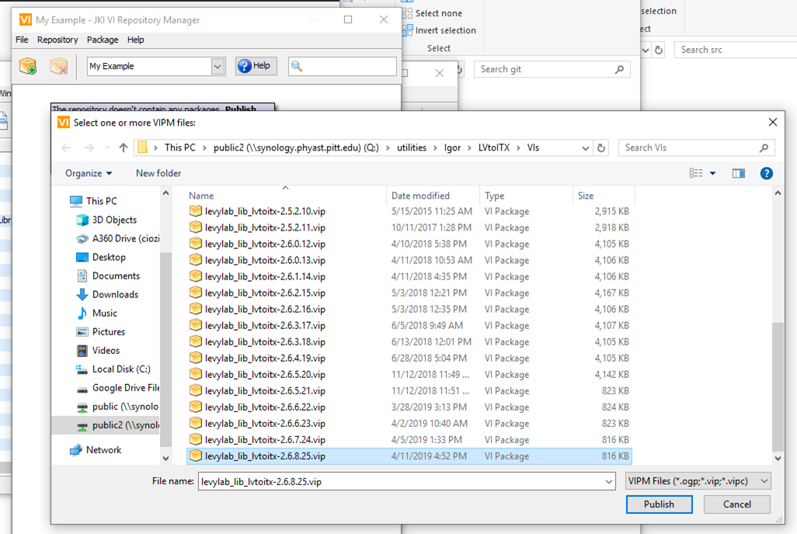
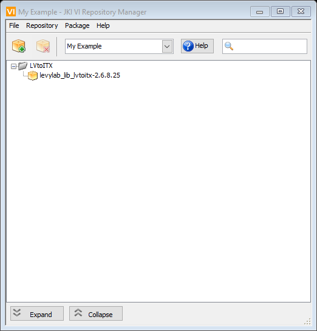
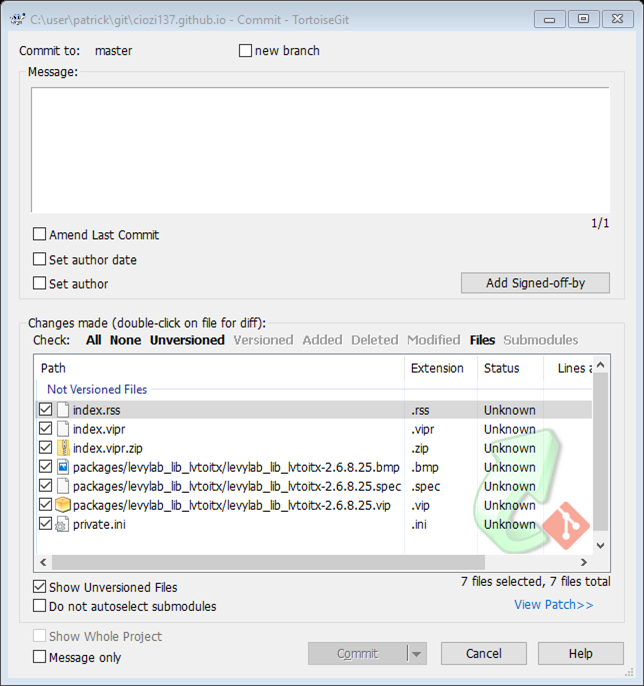

# Host Your Own VIPM Repository on GitHub

Host your VI Package Manager repository on GitHub

1. Follow the instructions [here](https://pages.github.com/) to create a site on GitHub.
The repository must have the name [username].github.io in order to work.

2. Create a new file in your repository called "index.html". Commit your new file. You can then view your site by visiting "[username].github.io" in about 10 minutes.

3. In the meantime, setup VI Package Manager. Clone your newly created git repository by running "git clone"

4. In VI Package Manager open Tools >> Options >> Repository Manager

5. Click the "+" sign to browse for your [username].github.io repository folder. Give your repository a name.

6. While you are still in the VIPM >> Options window, go to the Network Tab of VIPM and subscribe to https://[username].github.io

7. VIPM will not find any packages yet because you did not yet synchronize with the GitHub server. Before you do that add a package by going through the Repository Manager.

8. Git Commit and Synchronize your repository to GitHub.

9. Check for new changes in the VIPM repository
